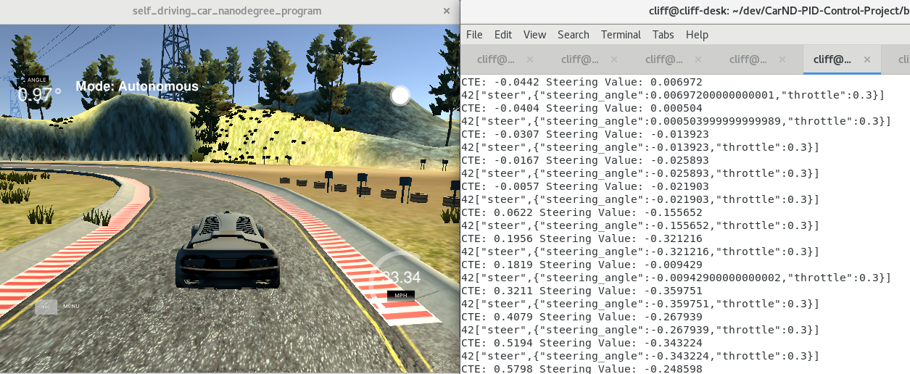
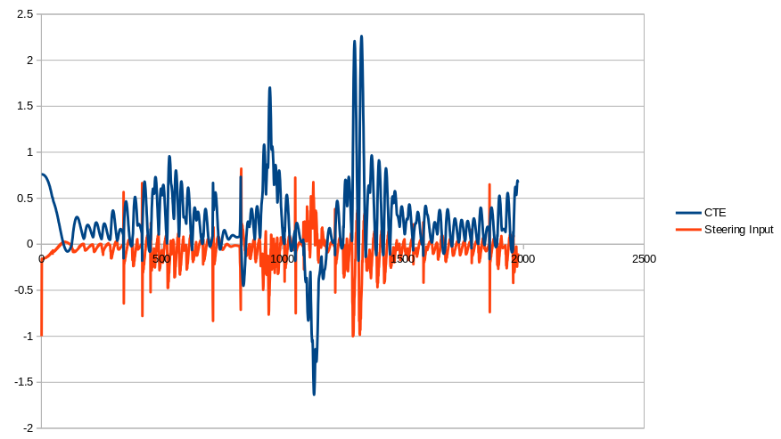

# CarND-Controls-PID
Self-Driving Car Engineer Nanodegree Program


---

## Summary
In this project we revisit the lake race track from the Behavioral Cloning Project. This time, however, a PID controller in C++ to maneuver the vehicle around the track is used.

The simulator will provide you the cross track error (CTE) and the velocity (mph) in order to compute the appropriate steering angle.

## Tuning

In tuning the PID controller, I started with the Proportional gain, tuning to a value that keeps the car on a straight section of road, the bridge area. Basically see if bang-bang only control can keep the car on the road.

I started with Kp = 0.01 and increased the value until the car started oscillating constantly, but where the oscillating did not increase/amplify. The final Kp was 0.1. 

Then I increased Kd to smooth out the oscillations, and ended up with Kd = 1.0. 

Then to handled the very sharp turns, I increased Kp and Kd together and ended up with Kp = 0.21 and Kd = 2.1 for crisp control that is not over damped.

I did not need to alter Ki as there was no inherent cross track drift and no information about tire slip and assumed the road was flat. Hence Ki = 0.

## Reflection

Kp, Ki, Kd changes appropriately behaved as described in the lesson material. Increasing Kp created overshoots in steering. Increasing Kd dampened those overshoots and increasing Ki forced a offset from the center line of the road.                   This was described here (credit: Udacity):


For example, increasing Kp to 1.0 caused the car to violently steering and overshoot and eventually off the road. Increasing Ki (1.0) would cause the car to overshoot immediately. Increasing Kd (10.0) to a point there was diminishing returns where drifting "off center" occured.

Having a **Kp of 0.21, Ki = 0 and Kd of 2.1**, the car stayed in the middle of the lane as shown in this video
[](https://youtu.be/4u69CFZbF5c "Click to Play Video")

Looking at the graph of *cte vs steering input*, I was able to simply increase the PID gains and keep the car in the road. Other tuning aids were not needed (Twiddle, opt, etc.) since we assumed the road was flat, no slip/drag issues and zero latency on steering input.




## Dependencies 

* cmake >= 3.5
 * All OSes: [click here for installation instructions](https://cmake.org/install/)
* make >= 4.1(mac, linux), 3.81(Windows)
  * Linux: make is installed by default on most Linux distros
  * Mac: [install Xcode command line tools to get make](https://developer.apple.com/xcode/features/)
  * Windows: [Click here for installation instructions](http://gnuwin32.sourceforge.net/packages/make.htm)
* gcc/g++ >= 5.4
  * Linux: gcc / g++ is installed by default on most Linux distros
  * Mac: same deal as make - [install Xcode command line tools]((https://developer.apple.com/xcode/features/)
  * Windows: recommend using [MinGW](http://www.mingw.org/)
* [uWebSockets](https://github.com/uWebSockets/uWebSockets)
  * Run either `./install-mac.sh` or `./install-ubuntu.sh`.
  * If you install from source, checkout to commit `e94b6e1`, i.e.
    ```
    git clone https://github.com/uWebSockets/uWebSockets 
    cd uWebSockets
    git checkout e94b6e1
    ```
    Some function signatures have changed in v0.14.x. See [this PR](https://github.com/udacity/CarND-MPC-Project/pull/3) for more details.
* Simulator. You can download these from the [project intro page](https://github.com/udacity/self-driving-car-sim/releases) in the classroom.

There's an experimental patch for windows in this [PR](https://github.com/udacity/CarND-PID-Control-Project/pull/3)

## Basic Build Instructions

1. Clone this repo.
2. Make a build directory: `mkdir build && cd build`
3. Compile: `cmake .. && make`
4. Run it: `./pid`. 

Tips for setting up your environment can be found [here](https://classroom.udacity.com/nanodegrees/nd013/parts/40f38239-66b6-46ec-ae68-03afd8a601c8/modules/0949fca6-b379-42af-a919-ee50aa304e6a/lessons/f758c44c-5e40-4e01-93b5-1a82aa4e044f/concepts/23d376c7-0195-4276-bdf0-e02f1f3c665d)

## Editor Settings

We've purposefully kept editor configuration files out of this repo in order to
keep it as simple and environment agnostic as possible. However, we recommend
using the following settings:

* indent using spaces
* set tab width to 2 spaces (keeps the matrices in source code aligned)

## Code Style

Please (do your best to) stick to [Google's C++ style guide](https://google.github.io/styleguide/cppguide.html).

## Project Instructions and Rubric

Note: regardless of the changes you make, your project must be buildable using
cmake and make!

More information is only accessible by people who are already enrolled in Term 2
of CarND. If you are enrolled, see [the project page](https://classroom.udacity.com/nanodegrees/nd013/parts/40f38239-66b6-46ec-ae68-03afd8a601c8/modules/f1820894-8322-4bb3-81aa-b26b3c6dcbaf/lessons/e8235395-22dd-4b87-88e0-d108c5e5bbf4/concepts/6a4d8d42-6a04-4aa6-b284-1697c0fd6562)
for instructions and the project rubric.

## Hints!

* You don't have to follow this directory structure, but if you do, your work
  will span all of the .cpp files here. Keep an eye out for TODOs.

## Call for IDE Profiles Pull Requests

Help your fellow students!

We decided to create Makefiles with cmake to keep this project as platform
agnostic as possible. Similarly, we omitted IDE profiles in order to we ensure
that students don't feel pressured to use one IDE or another.

However! I'd love to help people get up and running with their IDEs of choice.
If you've created a profile for an IDE that you think other students would
appreciate, we'd love to have you add the requisite profile files and
instructions to ide_profiles/. For example if you wanted to add a VS Code
profile, you'd add:

* /ide_profiles/vscode/.vscode
* /ide_profiles/vscode/README.md

The README should explain what the profile does, how to take advantage of it,
and how to install it.

Frankly, I've never been involved in a project with multiple IDE profiles
before. I believe the best way to handle this would be to keep them out of the
repo root to avoid clutter. My expectation is that most profiles will include
instructions to copy files to a new location to get picked up by the IDE, but
that's just a guess.

One last note here: regardless of the IDE used, every submitted project must
still be compilable with cmake and make./

## How to write a README
A well written README file can enhance your project and portfolio.  Develop your abilities to create professional README files by completing [this free course](https://www.udacity.com/course/writing-readmes--ud777).

